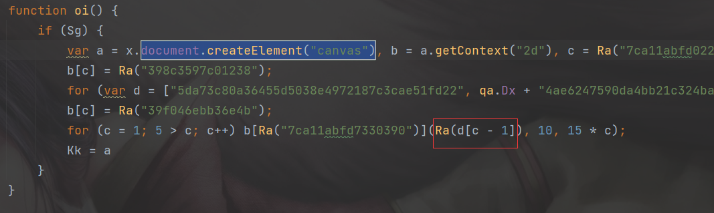
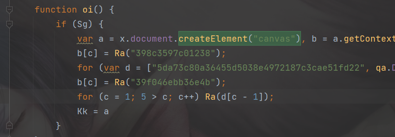

# gojs 去水印方法

## 原理

gojs是使用 canvas 进行绘制的，在源码中应该有`getContext("2d")`这样的字符，在`./node_modules/gojs/release/go.js`
能搜到3处。分析后，定位字符串`document.createElement("canvas")`的位置就是渲染函数。只需要注释其中渲染水印的方法即可去水印。

1. 去水印前

2. 去水印后


## 一键脚本

通过正则表达式可以快速的去掉生成水印的函数，

```js
const fs = require('fs')
const path = require('path')
const file = path.join(__dirname, './node_modules/gojs/release/go.js');
// 注意该文件如果是模块化引入，文件路径应该是./node_modules/gojs/release/go-module.js 如果没有生效可以试试这个文件路径

//去除gojs水印
fs.readFile(file, 'utf8', function (err, data) {
    if (err) throw err;
    let hasMatch = false;
    // 2.0 版本的 版去水印
    let content = data.replace(/[\w\W]{8}7eba17a4ca3b1a8346[\w\W]{31}/gi, function (match) {
        if(match) hasMatch = true;
        return 'function(){ return true; }'
    });
    // 2.1版去水印
    if(!hasMatch){
        // 查找绘制文本的语句
        content = data.replace(/[^)^{}]*7ca11abfd7330390[^;]*/gi, function (match) {
            // 查找语句中的获取水印文本函数
            let m=/]\(([^,]+)/.exec(match);
            // console.log(arr);
            // 用该函数整个替换绘制函数
            return m && m.length>=1 && m[1];
        });
    }
    fs.writeFile(file, content, 'utf8', (err) => {
        if (err) throw err;
        console.log('去水印完成！');
    });
});

```
