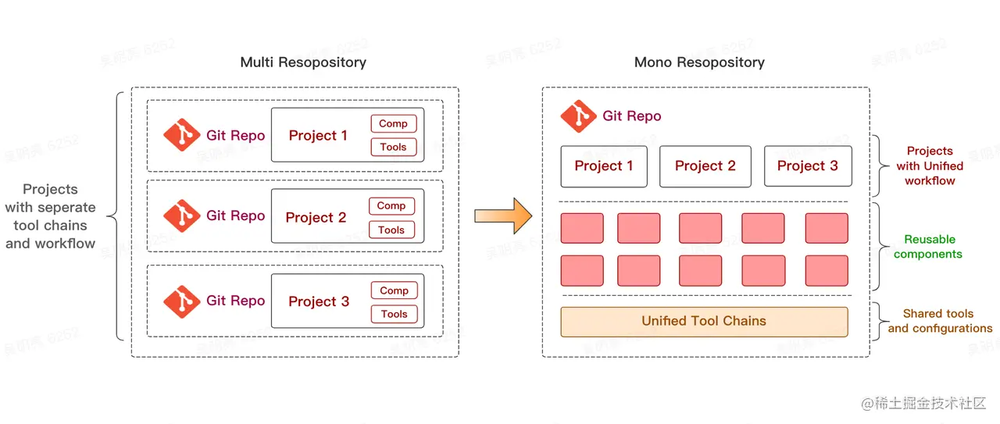

# 前端工程化之 monorepo

## 一、概念

就是把多个项目放在一个仓库里面，相对立的是传统的 MultiRepo 模式，即每个项目对应一个单独的仓库来分散管理。



monorepo 管理下的目录，每个子项目都是独立的，既可以配合上git submodule 分开管理，又能在在使用时相互引用。

```bash
├── packages
|   ├── pkg1
|   |   ├── package.json
|   ├── pkg2
|   |   ├── package.json
├── package.json
```

## 二、意义

### 1. 解决了 MultiRepo 中代码复用的问题

解决项目间 `copy` 代码比较好的方式是将公共的逻辑代码抽取出来，作为一个 npm 包进行发布，一旦需要改动，就只需要改动一份代码。

### 2. 解决了包的版本管理问题

项目之间的依赖

### 3. 一致的工作流

由于在 MultiRepo 当中，各个项目的工作流是割裂的，因此每个项目需要单独配置开发环境、配置 CI 流程、配置部署发布流程等等，甚至每个项目都有自己单独的一套脚手架工具。统一了项目的基建内容。

## 示例

monorepo 的实现有很多，nx/rush/lerna/bit等。TurboRepo 则是比较新的一个实现，它并行处理和增量构建的方式让他性能比其他几个更优秀。[入门指南](https://juejin.cn/post/7129267782515949575)

### 开始

```bash
npx create-turbo@latest
```

查看目录 tree -L -I

```bash
├── README.md
├── apps
│   ├── docs
│   └── web
├── package.json
├── packages
│   ├── eslint-config-custom
│   ├── tsconfig
│   └── ui
├── turbo.json
└── yarn.lock
```
