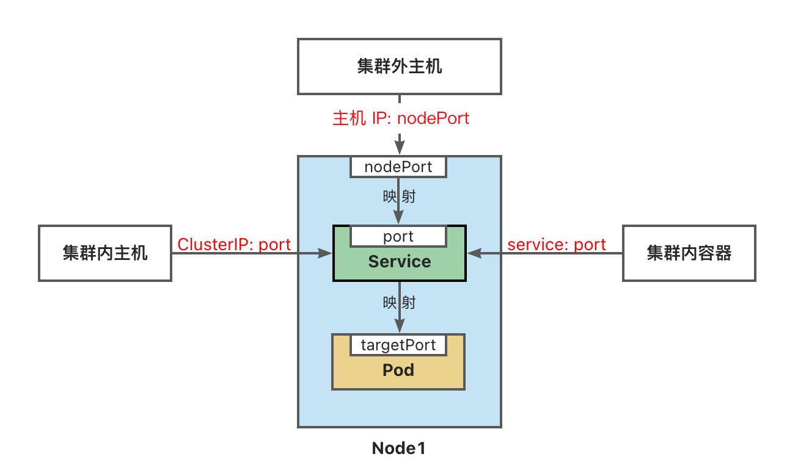

# K8s 入门

[教程](https://juejin.cn/post/6952331691524358174)  
[kubernetes 文档](https://kubernetes.io/zh/docs/tutorials/kubernetes-basics/create-cluster/cluster-intro/)  
[k3s 文档](https://docs.rancher.cn/docs/k3s/quick-start/_index)

## 一、K3S

Kubernetes 是一个开源的容器编排引擎和容器集群管理工具，用来对容器化应用进行自动化部署、 扩缩和管理。k3s 是轻量级 kubenetes，跟 k8s 差不多  
[学习资料](https://www.yuque.com/wukong-zorrm/qdoy5p/lgspzc)

### (一). 安装

#### 1. 在主服务器上安装 master 节点，k3s server

```bash
curl -sfL https://get.k3s.io | sh -
# 使用国内代理
curl -sfL https://rancher-mirror.rancher.cn/k3s/k3s-install.sh | INSTALL_K3S_MIRROR=cn sh -

# 如果安装不上时，可能需要先更新ca证书
yum update -y ca-certificates # 更新证书
yum-config-manager --disable rancher-k3s-common-stable # 禁用 rancher-k3s-common-stable 源 --enable 启用
```

#### 2. 在其他服务器安装工作节点，k3s-agent

安装 work 节点时，需要先获取 master 节点上的 url 和 token

> token 位于 /var/lib/rancher/k3s/server/node-token

```bash
K3S_URL=https://10.10.1.123:6443
K3S_TOKEN=K1042e2f8e353b9409472c1e0cca8457abe184dc7be3f0805109e92c50c193ceb42::node:c83acbf89a7de7026d6f6928dc270028
curl -sfL https://get.k3s.io | K3S_URL=${K3S_URL} K3S_TOKEN=${K3S_TOKEN} sh -
# 换源如下
curl -sfL https://rancher-mirror.rancher.cn/k3s/k3s-install.sh | INSTALL_K3S_MIRROR=cn K3S_URL=${K3S_URL} K3S_TOKEN=${K3S_TOKEN} sh -
### 命令
```

#### 3. 修改镜像仓库

安装完成后，就可以通过以下命令查看 k3s 集群的状态，和设置镜像仓库。

```bash
# 每隔 1 秒查看 node 的安装状态
watch -n 1 kubectl get node

# 修改配置后重启
systemctl restart k3s
```

k3s 镜像仓库的配置文件位于 /etc/rancher/k3s/registries.yaml，不要修改生成 /var/lib/rancher/k3s/agent/etc/containerd/config.toml

```yaml
mirrors:
    "docker.io":
        endpoint:
            - "https://fsp2sfpr.mirror.aliyuncs.com"
```

### (二)、命令

```bash
# 获取集群信息
kubectl cluster-info

# 获取所有资源
kubectl get all

# 获取集群节点状态
kubectl get lease -A

# 网络信息
kubectl get endpoints -n kube-system

# 查看 IngressRoute
kubectl get IngressRoute -A

# crictl 命令来查看正在运行的容器，与 docker 命令差不多
crictl ps

# 将pod端口映射到主机端口
kubectl port-forward <pod-name> <host-port>:<pod-port>

# 删除指定命名空间下的所有东西
kubectl delete all --all -n <namespace>

# 停止 k3s，重置容器、网络、iptables
/usr/local/bin/k3s-killall.sh
```

### (三)、离线导入导出镜像

#### 1. docker 中

```bash
# 导出镜像
docker save -o <path for generated tar file> <image name>
docker save image_name > image_name.tar # 保存到当前目录
# 导入镜像
docker load -i <path to image tar file>
```

#### 2. k8s 中

因为底层改为了 containerd，所以不能直接使用 docker 命令，需要使用 crictl 命令来导入导出镜像

```bash
# 导出镜像
crictl -n k8s.io images export <file.tar> docker.io/library/<image name>:<tag> --platform linux/amd64

# 导入镜像, 镜像都在k8s.io命名空间下
crictl -n k8s.io images import <image name> --platform linux/amd64

```

## 二、Pod（容器集）

Pod 是包含一个或多个容器的容器组，是 Kubernetes 中创建和管理的最小对象。

```bash
# 创建 pod，缩写是 po
kubectl run inginx --image=nginx:1.22
# 执行一次性任务
kubectl run ibusy --image=busybox -it --rm
# 指定标签
kubectl run inginx --image=nginx:1.22 --labels="app=inginx"

# 查看 pod 状态
kubectl get pod -A
kubectl get pod -o wide # 现实详细信息

# 查看 pod 运行日志
kubectl get logs -f inginx

# 查看 pod 详情
kubectl describe pod inginx

# 进入 pod
kubectl exec -it inginx -- /bin/bash

# 删除 pod
kubectl delete pod inginx
```

## 三、Deployment（部署）和 ReplicaSet（副本集）

Deployment 是对 ReplicaSet 和 Pod 更高级的抽象。
它使 Pod 拥有多副本，自愈，扩缩容、滚动升级等能力。

ReplicaSet(副本集)是一个 Pod 的集合。
它可以设置运行 Pod 的数量，确保任何时间都有指定数量的 Pod 副本在运行。
通常我们不直接使用 ReplicaSet，而是在 Deployment 中声明。

而 Deployment 可以看做是 ReplicaSet 的管理器，确保 ReplicaSet 中运行的 Pod 的数量和配置与 Deployment 中定义的一致。
他们的名称也是相互关联的

```bash
# 创建
kubectl create deployment dnginx --image=nginx:1.22 --replicas=3

# 查看
kubectl get deployment
# 查看详细信息
kubectl get deploy -o wide

# 缩放副本集
kubectl scale deployment dnginx --replicas=5
# 根据cpu自动缩放
kubectl autoscale deployment dnginx --min=3 --max=5 --cpu-percent=70
# 查看/删除 自动缩放
kubectl get hpa
kubectl describe hpa dnginx

# 更新镜像，滚动升级
kubectl set image deployment dnginx nginx=nginx:1.23

# 查看镜像的历史版本
kuebctl rollout history deployment dnginx
kuebctl rollout history deployment dnginx --revision=1 # 查看某个版本的详细信息

# 回滚到上一个版本
kubectl rollout undo deployment dninx
kubectl rollout undo deployment dninx --to-revision=1 # 回滚到指定版本
```

```bash
# 观察副本集，rs 是 replicaSet 的缩写
kuebcrl get replicaSet --watch

```

## 四、Service（服务）

Service 将运行在一组 Pods 上的应用程序公开为网络服务的抽象方法。
Service 为一组 Pod 提供相同的 DNS 名，并且在它们之间进行负载均衡。
Kubernetes 为 Pod 提供分配了 IP 地址，但 IP 地址可能会发生变化。
集群内的容器可以通过 service 名称访问服务，而不需要担心 Pod 的 IP 发生变化。

Kubernetes Service 定义了这样一种抽象：
逻辑上的一组可以互相替换的 Pod，通常称为微服务。
Service 对应的 Pod 集合通常是通过 [选择算符](https://kubernetes.io/zh-cn/docs/concepts/overview/working-with-objects/labels/) 来确定的。

举个例子，在一个 Service 中运行了 3 个 nginx 的副本。这些副本是可互换的，我们不需要关心它们调用了哪个 nginx，也不需要关注 Pod 的运行状态，只需要调用这个服务就可以了。

### 关于 ServiceType 的取值

-   `ClusterIP`：将服务公开在集群内部。kubernetes 会给服务分配一个集群内部的 IP，集群内的所有主机都可以通过这个 Cluster-IP 访问服务。集群内部的 Pod 可以通过 service 名称访问服务。
-   `NodePort`：通过每个节点的主机 IP 和静态端口（NodePort）暴露服务。 集群的外部主机可以使用节点 IP 和 NodePort 访问服务。
-   `ExternalName`：将集群外部的网络引入集群内部。
-   `LoadBalancer`：使用云提供商的负载均衡器向外部暴露服务。



```bash
# 获取服务， svc 是缩写
kubectl get services -A

# 查看服务详情
kubectl describe service dnginx

# 创建服务
kubectl expose deployment dnginx --name=nginx-service --port=8088 --target-port=80

kubectl expose deploy dnginx --name=nginx-outside --type=NodePort --port=8089 --target-port=80
```

## 五、Namespace(命名空间)

命名空间(Namespace)是一种资源隔离机制，将同一集群中的资源划分为相互隔离的组。
命名空间可以在多个用户之间划分集群资源（通过[资源配额](https://kubernetes.io/zh-cn/docs/concepts/policy/resource-quotas/)）。

-   例如我们可以设置开发、测试、生产等多个命名空间。

同一命名空间内的资源名称要唯一，但跨命名空间时没有这个要求。  
命名空间作用域仅针对带有名字空间的对象，例如 Deployment、Service 等。  
这种作用域对集群访问的对象不适用，例如 StorageClass、Node、PersistentVolume 等。

```bash
# 查看命名空间
kubectl get namespace

# 创建命名空间，ns 是 namespace 的缩写
kubectl create namespace dev

# 运行容器到指定命名空间， 缩写 -n=dev
kubectl run nginx --image=nginx:1.22 --namespace=dev

# 查看指定命名空间的 pod
kubectl get pod -n=dev

# 删除命名空间
kubectl delete namespace dev

# 查看当前命名空间
kubectl config current-context
# 设置默认命名空间
kubectl config set-context $(kubectl config current-context) --namespace=dev
```

## 六、Label(标签)

标签（Labels） 是附加到对象（比如 Pod）上的键值对，用于补充对象的描述信息。  
标签使用户能够以松散的方式管理对象映射，而无需客户端存储这些映射。  
由于一个集群中可能管理成千上万个容器，我们可以使用标签高效的进行选择和操作容器集合。

在实践中，`标签`和`选择器`一一对应，决定了 Service 如何选择一组 Pod。详细看 yaml 中配置

```bash
# 查看标签
kubectl get pods --show-labels

# 创建带标签的 pod
kubectl run nginx --image=nginx:1.22 --labels="app=nginx,env=dev"

# 查看指定标签的 pod
kubectl get pods -l app=nginx
kubectl get pods -l app=nginx,env=dev # 多个标签用逗号隔开，表示and关系
```

标签选择的两种方式

基于等值

```yaml
selector:
    matchLabels: # component=redis && version=7.0
        component: redis
        version: 7.0
```

基于集合

```yaml
selector:
    matchExpressions: # tier in (cache, backend) && environment not in (dev, prod)
        - { key: tier, operator: In, values: [cache, backend] }
        - { key: environment, operator: NotIn, values: [dev, prod] }
```

## 七、Yaml(声明式对象配置)

kubernetes 使用 yaml 文件来描述 Kubernetes 对象。

### 1. YAML 规范

-   缩进代表上下级关系
-   缩进时不允许使用 Tab 键，只允许使用空格，通常缩进 2 个空格
-   \: 键值对，后面必须有空格
-   \- 列表，后面必须有空格
-   \[ \] 数组
-   \# 注释
-   \| 多行文本块
-   \-\-\- 表示文档的开始，多用于分割多个资源对象

### 2. pod yaml 示例

在创建的 Kubernetes 对象所对应的 yaml 文件中，需要配置的字段如下：

-   apiVersion - Kubernetes API 的版本
-   kind - 对象类别，例如 Pod、Deployment、Service、ReplicaSet 等
-   metadata - 描述对象的元数据，包括一个 name 字符串、UID 和可选的 namespace
-   spec - 对象的配置

使用下命令可以直接创建一个
[示例](https://juejin.cn/post/7016215566234943524)
的 pod

::: code-tabs#shell

@tab:active 使用 pod.yaml 创建 pod

```bash
# 导出
kubectl get all --all-namespaces -o yaml > all.yaml
# 导入
kubectl apply -f pod.yaml
kubectl apply -f https://k8s.io/examples/pods/simple-pod.yaml

# 查看部署状态
kubectl get deploym
kubectl get po
kubectl get svc

# 删除
kubectl delete -f pod.yaml
```

@tab pod.yaml

```yaml
apiVersion: apps/v1
kind: Deployment
metadata:
    name: myapp-deployment
spec:
    replicas: 3
    selector:
        matchLabels:
            app: myapp
    template:
        # 这里面写的是 pod 模板
        metadata:
            labels:
                app: myapp
        spec:
            containers:
                - name: nginx-pod
                  image: nginx:1.22
                  ports:
                      - containerPort: 80

---
apiVersion: v1
kind: Service
metadata:
    name: myapp-service
spec:
    selector:
        app: myapp
    ports:
        - port: 8080
          targetPort: 80
          nodePort: 30080
    type: NodePort
    # LoadBalancer 时会自动分配 EXTERNAL-IP，从而将 nodePort 暴露到公网
```

:::

如果要修改端口映射 或者 EXTERNAL-IP 可以使用下面命令

```bash
# 查看 -n 命名空间
kubectl get services -n <namespace> <service-name>
# 修改
kubectl edit service myapp-service
# 修改  spec.ports 处理映射关系
# 修改  spec.type 为 LoadBalancer 时，会自动分配 EXTERNAL-IP
```

### 3. 安装 Dashboard

Kubernetes Dashboard 来管理 Kubernetes 集群

```bash
kubectl apply -f https://raw.githubusercontent.com/kubernetes/dashboard/v2.0.0/aio/deploy/recommended.yaml
# 启动Kubernetes Dashboard：
kubectl proxy

# 接下来，您可以在浏览器中访问
http://localhost:8001/api/v1/namespaces/kubernetes-dashboard/services/https:kubernetes-dashboard:/proxy/
# 来访问Kubernetes Dashboard。
```

## 八、 卷(Volume)

卷是独立于容器之外的一块存储区域，通过挂载(Mount)的方式供 Pod 中的容器使用。
使用场景

-   卷可以在多个容器之间共享数据。
-   卷可以将容器数据存储在外部存储或云存储上。
-   卷更容易备份或迁移。

### 1. 零时卷(EBphemeral Volume)

-   与 Pod 一起创建和删除，生命周期与 Pod 相同
-   emptyDir - 初始内容为空的本地临时目录
-   configMap - 为 Pod 注入配置文件
-   secret - 为 Pod 注入加密数据

### 2. 持久卷(Persistent Volume)

删除 Pod 后，持久卷不会被删除

1 **本地存储**

-   hostPath - 节点主机上的目录或文件
    (仅供单节点测试使用；多节点集群请用 local 卷代替)
-   local - 节点上挂载的本地存储设备(不支持动态创建卷)

2 **网络存储**

-   NFS - 网络文件系统 (NFS)

3 **分布式存储**

-   Ceph(cephfs 文件存储、rbd 块存储)

### 3. 投射卷(Projected Volumes)

-   projected 卷可以将多个卷映射到同一个目录上

## 九、存储类(Storage Class)

## 十、创建有状态应用

### 1. 创建 mysql 应用

1 .配置环境变量  
 传递给容器的环境变量，可以在容器内部使用，也可以在容器启动时使用

2. 挂载数据卷  
   `hostPath` 卷将主机节点上的文件或目录挂载到 Pod 中。  
   hostPath 仅用于在单节点集群上进行开发和测试，不适用于多节点集群；  
   例如，当 Pod 被重新创建时，可能会被调度到与原先不同的节点上，导致新的 Pod 没有数据。
   在多节点集群使用本地存储，可以使用 `local` 卷。

hostPath 的 type 值:

-   DirectoryOrCreate：如果路径不存在，则创建一个目录
-   Directory：如果路径不存在，则挂载失败
-   FileOrCreate：如果文件不存在，则创建一个文件
-   File：如果文件不存在，则挂载失败
-   Socket：如果套接字文件不存在，则挂载失败

```yaml
apiVersion: v1
kind: Pod
metadata:
    name: mysql-pod
spec:
    containers:
        - name: mysql
          image: mysql:8.0
          env:
              - name: MYSQL_ROOT_PASSWORD
                value: "123456"
          ports:
              - containerPort: 3306
          volumeMounts:
              - mountPath: /var/lib/mysql #容器中的目录
                name: data-volume
    volumes:
        - name: data-volume
          hostPath:
              # 宿主机上目录位置
              path: /data/mysql/data
              type: DirectoryOrCreate
```

### 2. ConfigMap 与 Secret

在 Kubernetes 集群中，容器可能被调度到任意节点，配置文件需要能在集群任意节点上访问、分发和更新。

```bash
# 更新配置文件，cm 是configmap的缩写，myapp-config 是配置名
kubectl edit cm myapp-config

# 查看配置文件
kubectl describe cm myapp-config
```

```yaml
apiVersion: v1
kind: Secret
metadata:
    name: mysql-password
type: Opaque
data:
    PASSWORD: MTIzNDU2Cg== # base64 编码 123456
---
apiVersion: v1
kind: Pod
metadata:
    name: mysql-pod
spec:
    containers:
        - name: mysql
          image: mysql:5.7
          env:
              - name: MYSQL_ROOT_PASSWORD
                # 读取secret中的值
                valueFrom:
                    secretKeyRef:
                        name: mysql-password
                        key: PASSWORD
                        optional: false # 此值为默认值；表示secret已经存在了
          volumeMounts:
              - mountPath: /var/lib/mysql
                name: data-volume
              - mountPath: /etc/mysql/conf.d
                name: conf-volume # 挂载卷的名字
                readOnly: true
    volumes:
        - name: conf-volume
          configMap:
              name: mysql-config # 使用configmap的名字来挂载到集群
        - name: data-volume
          hostPath:
              # directory location on host
              path: /home/mysql/data
              # this field is optional
              type: DirectoryOrCreate
---
apiVersion: v1
kind: ConfigMap
metadata:
    name: mysql-config
data:
    mysql.cnf: |
        [mysqld]
        character-set-server=utf8mb4
        collation-server=utf8mb4_general_ci
        init-connect='SET NAMES utf8mb4'

        [client]
        default-character-set=utf8mb4

        [mysql]
        default-character-set=utf8mb4
```
