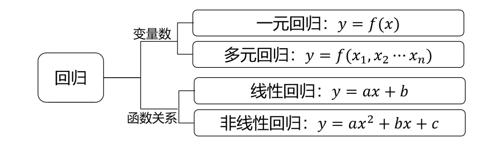
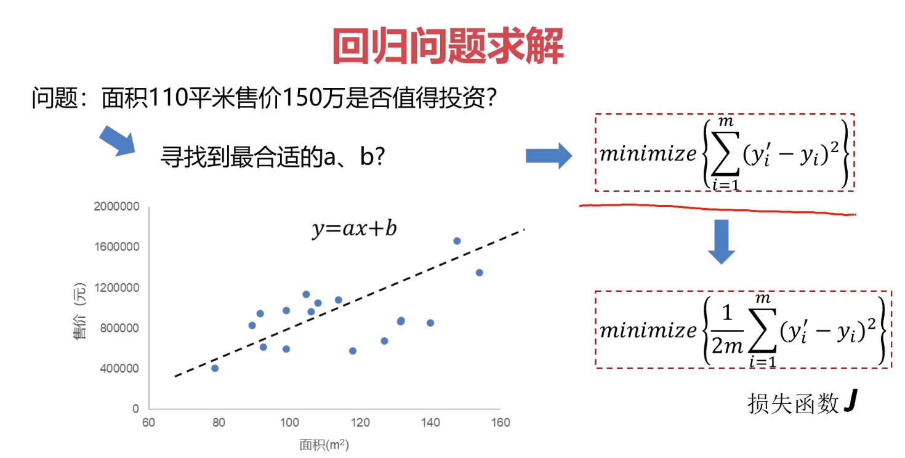
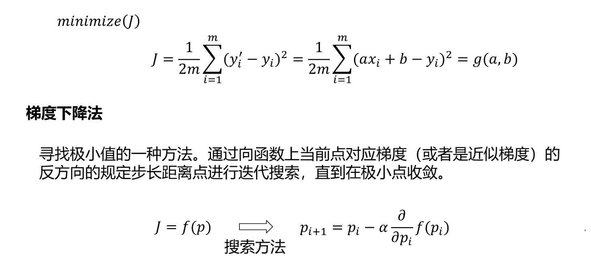
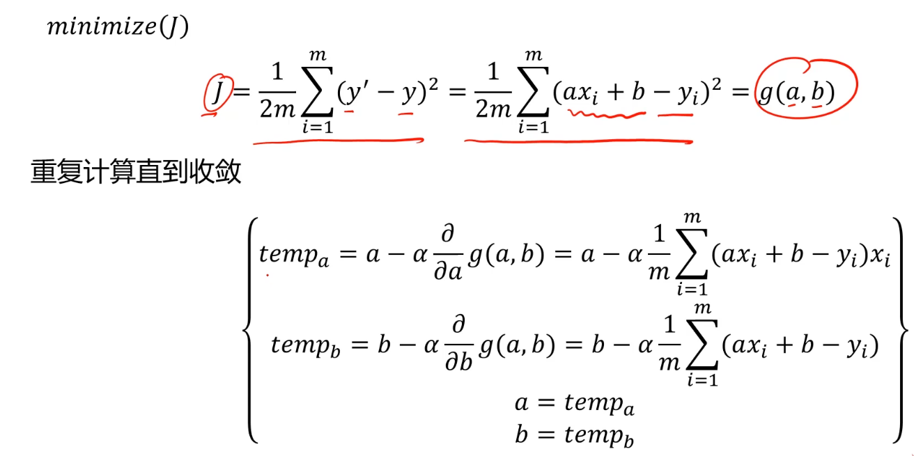
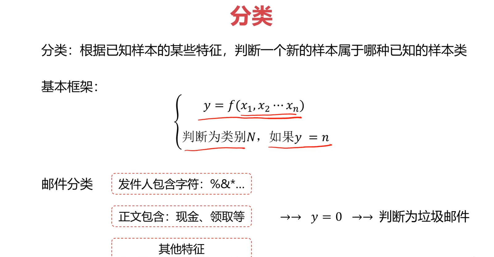
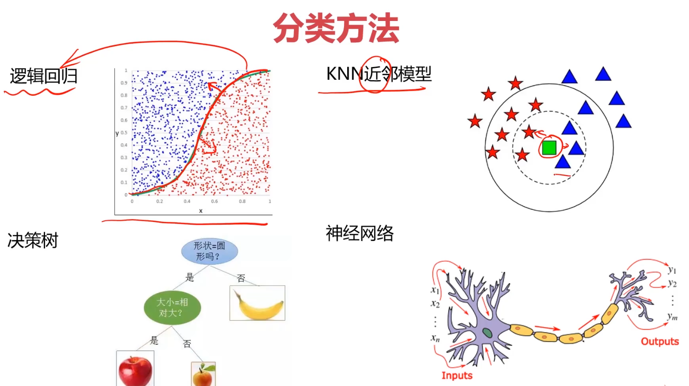

# 人工智障

## 开始

1. pycharm 可以打开科学模式，并使用 `#%%` 来使用代码块执行，可以保留之前执行过的上下文
2. matplotlib 是数据可视化的库，numpy 用于科学计算的包，pandas 处理数据的包，scikit-learn 机器学习的算法库
3. 监督学习：包含正确结果。线性回归，逻辑回归，决策树，神经网络，卷积神经网络，循环神经网络
4. 无监督学习：不包含，聚类算法
5. 混合学习：半监督学习
6. 强化学习：根据奖惩学习优化

## 回归



### 线性回归

1. 例如房价问题，择线性模型 y = ax + b
2. 假设 x 为变量，y 为结果，模型输出结果 y'= xa + b, 则只需要求 y 和 y'的差的平方和为最小值。
   
3. 为方便求解除以 2 倍样本数量：2m，就可转换成求`损失函数`的最小值， [损失函数？](https://zhuanlan.zhihu.com/p/58883095)
4. 损失函数的最小值可以通过`梯度下降法`求解，其实`梯度下降法`是根据 p1 的斜率计算 p1+α 的值，在求得这个值在 f(p2)时对应的 p2 的值。
   
   
5. 评估模型
    - 均方误差：MES。小
    - R 方值：R²=1 - MES/方差。近 1
    - 绘图展示

#### 单因子线性回归

```python
#%%
import pandas as pd

# 读取数据
data = pd.read_csv("./ai/data/linear.csv")
data.head()
print(type(data), data.shape)
# print(data)

# 赋值x y
x = data.loc[:, 'x']
y = data.loc[:, 'y']
print(x, y)

#%%
# visualize data 展示散点图
from matplotlib import pyplot as plot
plot.figure()
plot.scatter(x, y)
plot.show()

#%% 建立模型 set up regression model
from sklearn.linear_model import LinearRegression
import numpy as np
lr = LinearRegression()

# 转换数据维度
x = np.array(x).reshape(-1, 1)  # -1不变，1为补充
y = np.array(y).reshape(-1, 1)

# 拟合模型
lr.fit(x, y)
a = lr.coef_
b = lr.intercept_
print('a is {}, b is {}'.format(*(a, b)))

# 预测
predict = lr.predict(x)
# print('predict y is {}'.format(predict))

#%% 评估误差
from sklearn.metrics import mean_squared_error, r2_score
MSE = mean_squared_error(y, predict)
R2 = r2_score(y, predict)
print(MSE, R2)
plot.figure()
plot.plot(y, predict)
plot.show()
```

### 逻辑回归

#### 分类

根据已知样本的特征，判断新的样本属于哪一只已知的类别，例如：垃圾邮件分类，图像识别，数字识别，通过预测


