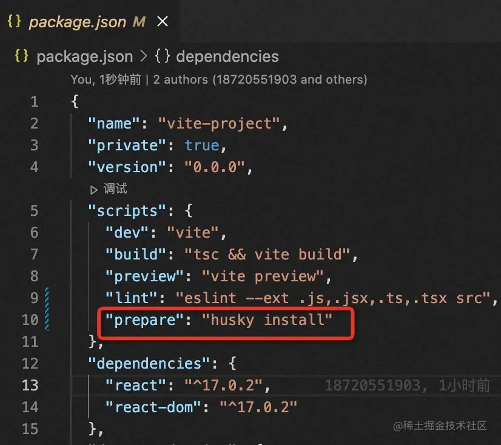
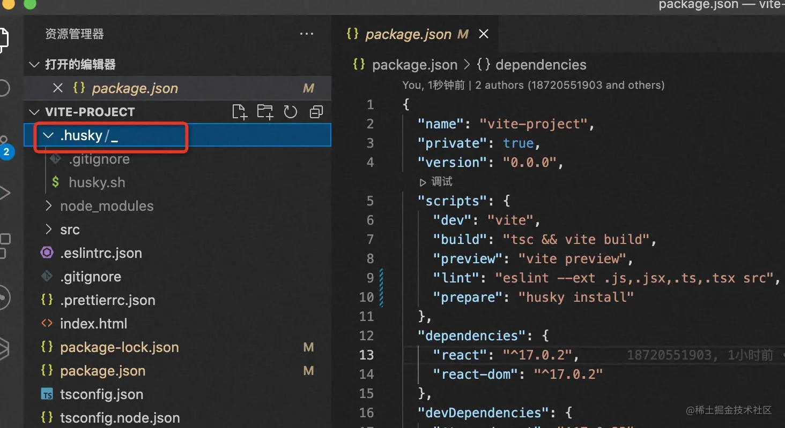

# 为前端项目添加强制规范

## 初始化项目

```bash
yarn create vite
```

## 添加`eslint`

### 安装

```bash
npm i -D eslint
```

### 初始化

```bash
npx eslint --init

✔ How would you like to use ESLint?
# To check syntax, find problems, and enforce code style
✔ What type of modules does your project use?
# JavaScript modules (import/export)
✔ Which framework does your project use?
# react
✔ Does your project use TypeScript?
# Yes
✔ Where does your code run?
# browser
✔ How would you like to define a style for your project?
# Use a popular style guide
✔ Which style guide do you want to follow?
# Airbnb
✔ What format do you want your config file to be in?
# JavaScript
```

## 添加`prettier`

### 安装 prettier

```bash
npm i -D prettier eslint-config-prettier eslint-plugin-prettier
```

### 配置 prettier

-   根目录下`.eslintrc.json`文件中添加`extends`设置

```js
{
    // ...
    "extends": [
        // ...
        "plugin:prettier/recommended",
    ],
}
```

-   根目录下创建`.prettierrc.json`文件，修改后要重启 ide

```js
{
  "trailingComma": "es5",
  "tabWidth": 2,
  "semi": true,
  "singleQuote": true
}
```

## 添加 `husky`和`lint-stage`

### 安装 `husky`和`lint-stage`

```bash
npm i -D lint-staged husky
```

### 配置 `husky`

1. 在 package.json 中添加脚本

```bash
npm set-script prepare "husky install"
```

package.json 文件的 scripts 中，就会自动添加 prepare 脚本



2. 初始化 husky,将 git hooks 钩子交由 husky 执行

```bash
npm run prepare
```

会在根目录创建.husky 文件夹


3. 配置 package.json



package.json 文件如下：

```js
{
  "env": {
    "browser": true,
    "node": true,
    "es2021": true
  },
  "extends": [
    "plugin:react/recommended",
    "airbnb",
    "plugin:prettier/recommended",
    "plugin:import/recommended"
  ],
  "parser": "@typescript-eslint/parser",
  "parserOptions": {
    "ecmaFeatures": {
      "jsx": true
    },
    "ecmaVersion": "latest",
    "sourceType": "module"
  },
  "plugins": ["react", "@typescript-eslint"],
  "rules": {
    "import/no-extraneous-dependencies": [
      "error",
      {"devDependencies": true}
    ],
    "react/jsx-filename-extension": [
      "error",
      {
        "extensions": [".js", ".jsx", ".tsx", ".ts"]
      }
    ],
    "import/no-unresolved": "off",
    "import/extensions": "off",
    "import/no-absolute-path": "off"
  }
}
```

4. 添加钩子 pre-commit

```bash
npx husky add .husky/pre-commit "npx lint-staged"
```

## 配置`commitlint`

-   作用：规范提交信息
-   格式：git commit -m '类型: 描述性文字'

| 类型     | 概念                                                   |
| -------- | ------------------------------------------------------ |
| build    | 编译相关的修改，例如发布版本、对项目构建或者依赖的改动 |
| ci       | 持续集成修改                                           |
| docs     | 文档修改                                               |
| feat     | 新特性、新功能                                         |
| fix      | 修改 bug                                               |
| perf     | 优化相关，比如提升性能、体验                           |
| refactor | 代码重构                                               |
| revert   | 回滚到上一个版本                                       |
| style    | 代码格式修改, 注意不是 css 修改                        |
| test     | 测试用例修改                                           |
| chore    | 其他修改，比如改变构建流程、或者增加依赖库、工具等     |

### 安装 commitlint

```bash
npm i -D commitlint @commitlint/config-conventional
```

### 配置 commitlint

package.json 中配置 commitlint

```js
{
    // ...
    "commitlint": {
        "extends": [
            "@commitlint/config-conventional"
        ]
    }
}
```

-   添加钩子

```bash
npx husky add .husky/commit-msg 'npx --no-install commitlint --edit "$1"'
```

git commit 就会触发提交规范的校验了
