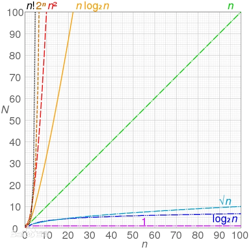

# 算法常识

## 入门术语

### 时间频度（次数）

一个算法花费的时间与算法中语句的执行次数成正比例，哪个算法中语句执行次数多，它花费时间就多。一个算法中的语句执行次数称为语句频度或时间频度。记为 T(n)。

### 时间复杂度

算法中基本操作重复执行的次数是问题规模 n 的某个函数，用 T(n)表示，若有某个辅助函数 f(n),使得当 n 趋近于无穷大时，T(n)/f(n) 的极限值为不等于零的常数，则称 f(n)是 T(n)的同数量级函数。记作 T(n)=O(f(n)),称 O(f(n)) 为算法的渐进时间复杂度，简称时间复杂度。  
在各种不同算法中，若算法中语句执行次数为一个常数，则时间复杂度为 O(1),另外，在时间频度不相同时，时间复杂度有可能相同，如 T(n)=n2+3n+4 与 T(n)=4n2+2n+1 它们的频度不同，但时间复杂度相同，都为 O(n2)。

注释：当 n 趋向 ∞ 时，存在 T(n)/f(n) = O，O≠0。记作：渐进时间复杂度 T(n) = O(f(n))

### 算法复杂度

算法复杂度分为时间复杂度和空间复杂度。其作用： 时间复杂度是指执行算法所需要的计算工作量；而空间复杂度是指执行这个算法所需要的内存空间。（算法的复杂性体运行该算法时的计算机所需资源的多少上，计算机资源最重要的是时间和空间（即寄存器）资源，因此复杂度分为时间和空间复杂度。）

## 时间复杂度类型



### 常数时间

若对于一个算法，的上界与输入大小无关，则称其具有常数时间，记作时间。一个例子是访问数组中的单个元素，因为访问它只需要一条指令。

### 对数时间

若算法的 T(n) =O((logn)^k)，则称其具有对数时间。由于计算机使用二进制的记数系统，对数常常以 2 为底（即 log2n，有时写作 lgn）。然而，由对数的换底公式，logan 和 logbn 只有一个常数因子不同，这个因子在大 O 记法中被丢弃。因此记作 O((logn)^k)，而不论对数的底是多少，是对数时间算法的标准记法。  
常见的具有对数时间的算法有二叉树的相关操作和二分搜索。  
对数时间的算法是非常有效的，因为每增加一个输入，其所需要的额外计算时间会变小。  
递归地将字符串砍半并且输出是这个类别函数的一个简单例子。它需要 O（log n）的时间因为每次输出之前我们都将字符串砍半。 这意味着，如果我们想增加输出的次数，我们需要将字符串长度加倍。

```javascript
function right(str) {
    const len = str.length
    const help = function (index) {
        if (index < len) {
            help(Math.ceil((len + index) / 2))
        }
    }
    help(0)
}
```

### 幂对数时间

### 次线性时间

### 线性时间

### 线性对数时间

### 多项式时间

### 超越多项式时间

### 准多项式时间

### 次指数时间

### 指数时间

### 双重指数时间
